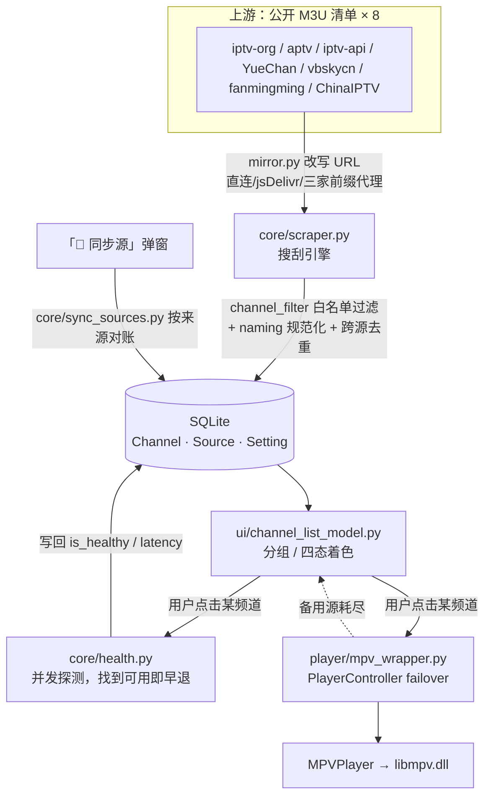

# LiuHaiTV 交接文档

写给**下一位维护者**（人，或者 AI 助手）。
目标：读完这一份就能上手改代码，不用把 21 个模块从头啃一遍。

> 文件名说明：`AGENTS.md` 是 AI 编程工具会自动读取的约定名（Claude Code、Codex 等都认），
> 同时完全可以当人看的架构文档用。想改成 `ARCHITECTURE.md` 也行，记得同步改 README 里的链接。

---

## 0. 30 秒速览

| 项 | 值 |
|---|---|
| 是什么 | Windows 桌面端**央视 / 省级卫视直播播放器** |
| 技术栈 | Python 3.11 · PySide6 6.11(Qt6) · mpv/libmpv · SQLite + SQLAlchemy 2.0 · httpx |
| 代码规模 | `liuhaitv/` 23 个文件 5332 行（其中 19 个功能模块 5241 行）；`scripts/` 11 个脚本 3354 行 |
| 入口 | `python scripts/run_gui.py` |
| 数据 | `data/liuhaitv.db`（Channel / Source / Setting 三张表） |
| 播放内核 | `bin/libmpv-2.dll`（115 MB，**不在仓库里**，需自行下载，见 README） |
| 协议 | GPL-3.0-or-later |
| 测试 | `scripts/verify_{data,player,ui,sync,naming}.py`，**288 条断言**，全离线 |

**一句话架构**：上游公开 M3U 清单 → 搜刮/同步 → SQLite → 频道列表 → 点击 → 探测 + mpv 播放 → 失败自动切源。

---

## 1. 跑起来

```bash
conda create -n liuhaitv python=3.11.7 && conda activate liuhaitv
pip install -r requirements.txt          # 只有 4 个依赖

# 下载 libmpv-2.dll 放进 bin/（README 有详细注意事项）
python scripts/check_env.py               # 自检：依赖 / 内核 / 数据库 / 网络
python scripts/run_gui.py                 # 启动
```

### 本机环境事实（换机器请忽略）

- **conda 环境名实际叫 `chinatv`**（历史遗留，没跟着项目改名）。
  解释器：`D:\Environment\AnacondaEnvs\chinatv\python.exe`
- 项目路径：`D:\Code\LiuHaiTv`
- 本机 **`raw.githubusercontent.com` 完全不通** → 所以项目自带 GitHub 加速器（见第 5 节）
- git 全局配了 `https.proxy = socks5://127.0.0.1:7890`（能推 GitHub）；
  注意 **git 不读 `HTTPS_PROXY` 环境变量**，只认自己的 `https.proxy`

---

## 2. 架构总览



一句话数据流：**清单 → 搜刮/同步 → 落库 → 列表 → 点击 → 探测 + 播放**。

线程模型：

| 线程 | 干什么 | 约束 |
|---|---|---|
| GUI 主线程 | 所有 QWidget | **绝不做网络 I/O** |
| QThreadPool 后台 | 健康探测（`ui/check_worker.py`）、同步任务（`ui/sync_dialog.py` 的 `SyncTask`） | 结果一律经 Qt 信号回主线程 |
| asyncio 事件循环 | `core/health.py` 的并发探测（在后台线程里 `asyncio.run`） | 探测在 DB 会话外做，写完再开短会话 |
| mpv 自己的线程 | 解码渲染，用 `wid` 嵌入 `VideoView` | 回调经 `register_event_callback`，转成普通回调 |

---

## 3. 模块地图

### `liuhaitv/` 顶层

| 文件 | 行数 | 职责 | 易踩的点 |
|---|---|---|---|
| `__init__.py` | 短 | 把 `bin/` 加进 `PATH`，让 `import mpv` 能找到 dll | **必须在任何 `import mpv` 之前 import 本包** |
| `config.py` | 283 | 集中配置：路径、网络参数、来源清单、加速方式 | 路径策略见第 5 节；改前先读文件头注释 |
| `logger.py` | 81 | `setup_logging()` 显式初始化一次，各模块 `get_logger(__name__)` | 别在 import 时自动配置，会重复加 handler |

### `liuhaitv/core/`（数据与逻辑，无 UI 依赖）

| 文件 | 行数 | 职责 |
|---|---|---|
| `models.py` | 160 | ORM：`Channel` / `Source` / `Setting` |
| `database.py` | 146 | 引擎、`session_scope()`、`init_db()`（含**幂等补列**，老库免迁移）、`reset_db()` |
| `m3u_parser.py` | 191 | M3U/M3U8 解析，容错各种野生写法 |
| `channel_filter.py` | 269 | **核心白名单**：只留央视 + 省级卫视；排除港澳台、省市地面、购物、境外、以及 iptv-org 里的"假央视"（`CCTV-Billiards` 之类）。另提供 `identity_key()` 做频道身份归键 |
| `naming.py` | 149 | **全项目唯一的规范显示名来源**：`CCTV4`→`CCTV-4`、`Beijing Satellite TV HD`→`北京卫视 HD` |
| `scraper.py` | 421 | 搜刮引擎：并行拉取 → 解析 → 过滤 → 去重合并 → 落库 |
| `health.py` | 341 | 异步探测：`verify_channel()`（判某台能否播）、`check_all()`、`probe_url()`（测单条地址） |
| `mirror.py` | 148 | GitHub 加速器：URL 改写 + 多候选 |
| `sync_sources.py` | 508 | **按来源对账**（不是无脑追加），规则见第 6 节 |
| `settings.py` | 88 | 键值偏好（音量等），所有异常都吞掉退回默认值 —— 偏好读不出来不该让主界面起不来 |

### `liuhaitv/player/`

| 文件 | 行数 | 职责 |
|---|---|---|
| `mpv_wrapper.py` | 285 | `MPVPlayer`（python-mpv 薄封装）+ `PlayerController`（failover 状态机） |

### `liuhaitv/ui/`

| 文件 | 行数 | 职责 |
|---|---|---|
| `main_window.py` | 537 | 主窗口：控制条、全屏、右键菜单、点击判定编排 |
| `channel_list_model.py` | 291 | 列表模型 + 四态颜色 + 自定义绘制 + **`ChannelListView`（右键不换台）** |
| `source_manager.py` | 820 | 源管理弹窗：增删改、置顶、上下移、启用、测速、导入 M3U |
| `sync_dialog.py` | 320 | 同步弹窗 + 后台 `SyncTask` |
| `check_worker.py` | 175 | 两类 QRunnable：频道判定 / 单源探测 |
| `video_view.py` | 28 | 拿 `winId()` 给 mpv 嵌入渲染 |

---

## 4. 数据模型

```
Channel                          一个频道
  id, name(规范显示名), group(中央/卫视/港澳台/地方/其他)
  sort_order, visible, last_watched_at, play_count
  last_status                    最后一次判定结果（仅记录，UI 颜色不读它）
  sources ──┐  一对多

Source                           一条直播地址
  channel_id(FK), url, default_priority(越小越优先)
  origin                         来源标识：'iptvorg_cn' / 'kimentanm' / 'user_manual' …
  source_id, kind(容器: m3u8/ts/flv…), protocol(ipv4/ipv6/domain)
  is_enabled, is_healthy, latency_ms, checked_at
  is_user_edited                 手动改过的标记 → 同步时**绝不覆盖**（见下）

Setting                          键值偏好（音量等）
```

**关键设计：`identity_key()` 而不是频道名做对齐键。**
上游叫 `Beijing Satellite TV`、库里叫 `北京卫视 HD`，两者 `identity_key` 都是 `sat:北京` ——
同步、去重、精简全靠它。**改 `channel_filter.identity_key()` 会同时影响搜刮/同步/精简三条链路**，慎改。

---

## 5. 核心设计决策（为什么这么做）

这一节是新维护者最需要读的：很多"看起来奇怪"的写法都是踩过坑之后的结论。

### 5.1 点哪个台才测哪个台，不是启动全量扫描
频道颜色**不来自启动时的全量探测**（几十个台 × 十几条源 = 几百次请求，开局要等很久），
而是**点了才测**。颜色四态：灰(未点击) / 橙(检测中) / 绿(能播) / 红(不能播)。

判定结果只存在 `ChannelListModel._status` 这个**会话内字典**里 —— 重启回全灰。
这是故意的：**不要用上次会话的陈旧绿色误导用户**。DB 的 `last_status` 只作排障记录。

### 5.2 failover 的排序是「健康 > 优先级」
`PlayerController._sorted_urls()` 按 `(is_healthy, default_priority)` 排。
所以用户在源管理里「置顶」的源，如果**没测过或测出来是红的**，仍会排在绿色源后面。
想让它真正先播，得先「测试选中」把它测绿。这是有意为之，不是 bug。

### 5.3 播放只试前 3 条源
`PlayerController.max_failovers = 2`（首发 1 条 + 最多再切 2 条）。
同步之后一个频道可能有十几条源，**第 4 条往后不会被用到**。想改就调这个值，
但注意：每条失败要等 mpv 报错，调太大用户会觉得"卡在那不动"。

### 5.4 同步是「按来源对账」，不是无脑追加
`core/sync_sources.py` 的规则（**改动前务必先读这个模块的 docstring**）：

| 情况 | 动作 |
|---|---|
| 同来源、未被手动改过 | **原地更换**为上游最新地址（行 id / 优先级不变） |
| 上游给了库里没有的地址 | **新增**一条源 |
| 上游不再提供的自动源 | **删除** |
| 该来源地址**被手动改过**（`is_user_edited=True`） | **绝不覆盖**，把上游地址另存为新源并**强制置顶** |
| `origin` 以 `user` 开头 | 完全不参与对账，永不删改 |

### 5.5 GitHub 加速器不是可选优化，是必需品
本机实测 `raw.githubusercontent.com` **完全不通**，而项目里 7/8 个来源都挂在它上面。
`core/mirror.py` 把 URL 改写成候选列表（直连 → jsDelivr → gh-proxy.com → ghproxy.net → ghfast.top），
**同步功能（`sync_sources`/`sync_dialog`）与同步弹窗共用这一份实现**，不要另写一套。

`mirror.py` 的 docstring 里记了**实测不可用**的代理（`mirror.ghproxy.com`、`hub.fastgit.xyz`、
`raw.kkgithub.com` 等），别再试了。

### 5.6 路径分两套（打包形态下别写错）
- `RESOURCE_ROOT` = 只读资源（`bin/libmpv-2.dll`、模板库）；打包后是 `sys._MEIPASS`
- `BASE_DIR` = **用户数据**根（`data/`、`logs/`）；打包后是 **exe 所在目录**

写进 `_MEIPASS` 的数据**会随进程退出消失**；写进安装目录又可能没权限。两者必须分开。

### 5.7 「源管理」所有操作立即写库
没有"确定/取消"，点关闭即生效 —— IPTV 工具的常见手感，也避免用户以为点了取消其实已改内存。

### 5.8 右键只弹菜单，不换台
`ChannelListView` 吞掉右键的 press/release。原因：`QAbstractItemView` 默认**任何鼠标键按下**
都会把 `currentIndex` 移到光标下那项，而主窗口把 `currentChanged` 当"播放这个台"的触发器
→ 右键顺手就换台。`contextMenuEvent` 是独立事件，所以菜单照常弹。

---

## 6. 常见改动怎么做（recipes）

| 想做的事 | 改哪里 | 注意 |
|---|---|---|
| **加一个上游来源** | `config.SCRAPE_SOURCES` 追加一项 | `default` 请保持 `False`（工具保持中立，用户自己勾） |
| **加一个 GitHub 加速方式** | `config.GITHUB_MIRRORS` + `MIRROR_TRY_ORDER` | 加完用 `mirror.candidates()` 验证改写结果 |
| **改频道名规范化规则** | `core/naming.py` | 只在形态**完全匹配**时改写，避免误伤（参考文件内注释） |
| **调整白名单（多收/少收某类台）** | `core/channel_filter.py` | 判定顺序很重要：港澳台规则必须**先于**卫视规则 |
| **改播放失败重试次数** | `PlayerController.max_failovers` | 见 5.3 |
| **改探测灵敏度** | `config.HEALTH_*`（并发 20 / 超时 8s / 读 4096 字节 / 延迟阈值 3000ms） | "可用" = HTTP<400 **且真的读到媒体字节**，防止 200 空页假阳性 |
| **改界面按钮** | `ui/main_window.py` 的控制条部分 | 同步更新 docstring 里的按钮清单 |
| **加一个数据库字段** | `core/models.py` + `database._migrate_columns()` | 补列是幂等的，老库能自动升级，别写一次性迁移脚本 |
| **精简/规范化现有库** | `scripts/prune_to_core.py` / `normalize_names.py` | 两者**默认只预演**，要加 `--apply` 才动手，动手前自动备份 |

---

## 7. 测试与验收

```bash
python scripts/verify_data.py      # 数据层：模型/解析/搜刮/白名单/归键/精简     64 条断言
python scripts/verify_player.py    # 播放链路：mpv 封装/failover/健康检测       17 条断言
python scripts/verify_ui.py        # 界面：列表/点击/源管理/三态/置顶/音量/右键   95 条断言
python scripts/verify_sync.py      # 同步：加速器/对账/新增频道三档/弹窗         52 条断言
python scripts/verify_naming.py    # 频道名规范化与改名脚本冲突保护             60 条断言
                                   #                                   合计 288 条
```

（数字口径：脚本运行时逐项打印 `OK` / `FAIL` 的行数。
用 `python scripts/verify_X.py 2>&1 | findstr /R "OK FAIL"` 之类可以自己复核。）

**全部离线**（临时库 + Qt offscreen），退出码 0 即通过。改任何逻辑后请全跑一遍。

### 加断言 / 改测试时必须知道的坑

1. **共用临时库 → 每段开始前 `reset_db()`**。
   `verify_data.py` 里的 `build_plan/apply_plan` 会**真删频道**，不清库会把上一段的数据当待删项。
2. **`QApplication` 只能建一次**（`verify_ui.py` 合并了 4 个原脚本，同进程建第二个会抛异常）。
3. 新增断言沿用 `check(label, cond)`；**退出码 0/1 是对外契约**。

### 历史沿革（防止被旧资料误导）

- 这些脚本原来是 `verify_step2.py … verify_step9_ui.py`（按开发阶段编号），已合并成现在 5 个。
  **日志文件里还留有旧的 logger 名，那是历史记录，不是现役代码。**
- 项目原名 **ChinaTV**、包名 `chinatv`，2026-09-24 整体改名为 **LiuHaiTV** / `liuhaitv`；
  数据文件 `chinatv.db`→`liuhaitv.db`、环境变量 `CHINATV_*`→`LIUHAITV_*`。
  旧笔记里出现 chinatv 就是同一套东西。

---

## 8. 雷区（改了会炸）

1. **`cfg.DB_PATH` 必须在 `import liuhaitv.core.database` 之前设好** —— 引擎在 import 时绑定路径。
   测试脚本都靠这个隔离真实库。
2. **`.gitignore` 不支持行尾注释**：
   ```gitignore
   data/     # 数据库      ← ❌ 整行被当成一个模式，一条也匹配不上（静默失效！）
   bin/                    ← ✅ 注释单独占一行
   ```
   这个坑真的踩过：差点把 249 MB 打包产物 + 含第三方直播地址的数据库推上 GitHub。
   **推之前先跑 `~/.workbuddy/skills/github-preflight/preflight.py`**。
3. **别把 `bin/`、`data/`、`logs/`、`protable/` 提交进仓库**（已 gitignore，别用 `-f` 绕过）。
4. **`liuhaitv/__init__.py` 必须先于 `import mpv`** —— 它负责把 `bin/` 加进 PATH。
5. **跨线程绝不直接碰 QWidget** —— 一律经 Qt 信号回主线程。
6. **改 `identity_key()` 会同时影响搜刮 / 同步 / 精简三条链路**，改完必须跑 5 个 verify。
7. **新增 `.py` 文件记得加首行** `# SPDX-License-Identifier: GPL-3.0-or-later`（现在 34/34 覆盖）。

---

## 9. 打包与分发

```powershell
$env:LIUHAITV_DISTNAME = "protable"
python -m PyInstaller --noconfirm --distpath D:\Code\LiuHaiTv `
       --workpath D:\Code\LiuHaiTv\build LiuHaiTV.spec
```

产物 `protable/` 约 **249 MB**（libmpv 115 + Qt ~90 + conda DLL 22）。

### 三个坑（spec 里已注释，别改回去）
1. **conda 运行时的 DLL 必须显式带上**（`_sqlite3.pyd` 依赖 `Library\bin` 下的 DLL，
   PyInstaller 搜不到 → 启动即 `ImportError: DLL load failed`）。spec 里把该目录 72 个 DLL 全加进 `binaries`。
2. **无控制台的 exe 出错是静默的** → `scripts/run_gui.py` 把重量级 import 放在**函数内**，
   这样顶层 `try/except` 才兜得住，失败会写 `logs/crash.log` + 弹原生提示框（用 ctypes，Qt 起不来时也能显示）。
3. **路径两套**，见 5.6。

### 分发
把 `protable/` 整个压缩上传到 **GitHub Release**（别塞进 git）。
分发时目录里要带上 **`使用说明.txt` + `LICENSE` + `THIRD_PARTY_NOTICES.md`** —— GPL 的硬要求。
`protable.rar` 是早期旧包（里面还是 `ChinaTV.exe`），已过时。

---

## 10. 仓库 / 协议 / 合规

- **仓库 41 个文件**（纯文本，约 420 KB）：`liuhaitv/`(23) + `scripts/`(11) + 文档/配置(7)
- **协议 GPL-3.0-or-later**，理由：运行时链接的 **mpv 社区构建是 GPL-2.0+**、
  **PySide6 授权为 `LGPL-3.0-only OR GPL-2.0-only OR GPL-3.0-only`**（三者择一），
  GPL-3.0 与它们都兼容。**想改用 MIT 必须先换 LGPL 版 libmpv**（zhongfly 有 `mpv-dev-lgpl-*.7z`）。
- `THIRD_PARTY_NOTICES.md` 列了全部依赖协议 + 8 个清单维护者 + 加速服务 + mpv 构建者。

### 合规红线（内容侧）
本项目**不存储、不分发任何音视频内容**，只有第三方公开 M3U 清单的 URL 配置。
**不要**往仓库里加任何地址列表、播放列表、抓包结果 —— 那是把风险引到自己身上。
清单来源的 `default` 一律 `False`（用户自己勾选），这也是保持工具中立性的设计。

---

## 11. 已知限制与待办

**限制**
- 播放只试前 3 条源（`max_failovers=2`）
- "健康"权重高于"优先级"（置顶的源若不健康仍排在绿色源之后）
- **没有 CLI 搜刮入口**：初次灌数据只能用界面的「🔄 同步源」，或放一份现成的 `data/liuhaitv.db`
- 上游命名偶有错别字（如"黑龙卫视"），`naming.py` 改不了
- 多个真央视共用同一台裸 IP，上游那台挂了会一起挂

**待办（想到了但没做）**
- [ ] 给 `scraper.py` 加一个 CLI 入口（`scripts/scrape.py`），便于无 GUI 环境灌数据
- [ ] `max_failovers` 改为可配置（放进 `config.py` 或设置界面）
- [ ] 音量记忆之外，考虑记住"上次观看的频道"（`Channel.last_watched_at` 已经在存了）
- [ ] 打包体积优化：Qt 插件按需裁剪，可能能省 30~50 MB

---

## 12. 接手第一天建议

1. `python scripts/check_env.py` → 确认环境 OK
2. 跑一遍 5 个 `verify_*.py` → 建立"现在是绿的"这个基准
3. `python scripts/run_gui.py` 点几个台，看四态颜色变化
4. 打开 `logs/liuhaitv.log` 跟着一次"点击 → 探测 → 播放"的完整日志
5. 改一个小东西（比如控制条按钮的 tooltip），跑 `verify_ui.py` 确认没坏 —— 熟悉流程
6. 再动上面的「雷区」里的东西
